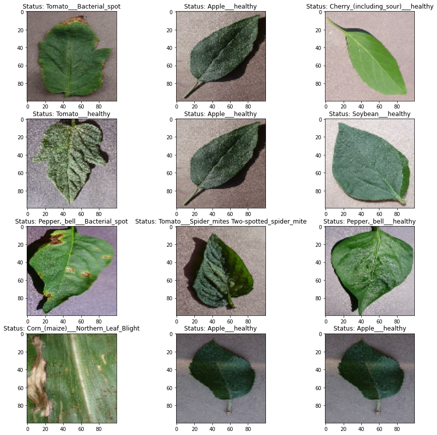

# Crop Leaf Disease Churn Prediction Using A Convolutional Neural Metwork

## Introduction

Agriculture has become an essential part of human life, even today. Agriculture is one of the main sources of food supply throughout the world. Each region has different agricultural commodities. Usually, these commodities are adjusted to the demand and suitability of the type of plant with the land. The increase in the world's population is also a factor that makes the need for agriculture higher. Agricultural activity is not without obstacles. One of the problems often experienced by farmers is plant disease. One part of the plant that is often affected by the disease is the leaf. The amount of production will experience a significant decrease if the leaves of the plant are affected by the disease. This happens because the leaves are a place for plants to produce food for growth. So, fast handling is necessary. One way that can be done to carry out fast handling is early identification of diseases that attack plant leaves.

Deep learning is part of a broader family of machine learning methods based on artificial neural networks with representation learning. One of the algorithms in deep learning is a convolutional neural network or CNN. CNN is a type of artificial neural network, which is widely used for image/object recognition and classification. Deep Learning thus recognizes objects in an image by using a CNN. Initial identification can be done by taking pictures of leaves affected by the disease, then deep learning computing is carried out to create models that can later be used to identify diseases in leaves instantly through images.

## Objective

The main objective to be achieved this time is generating and optimizing the CNN model for the identification of diseases that attack the leaves of agricultural plants through image recognition.

## Exploratory Analysis

There are 70295 total images in the training dataset image folder, 17572 total images in the validation dataset image folder, and 38 classes of healthy and diseased agricultural plant leave. At least, there are 14 types of agricultural crops are used as input datasets in this modeling. The 14 types of plants are apple, blueberry, cherry, corn, grape, orange, peach, bell pepper, potato, raspberry, soybean, squash, strawberry, and tomato. The pictures above are examples of some pictures of healthy and diseased leaves of agricultural plants. Prior to modeling, the images were made into a size of 100x100 and divided into 32 batches to ease the modeling process on the computer.

## Model Summary and Conclusion
Diseases that attack agricultural crops are one of the main causes for farmers to fail and suffer huge losses. In addition, the food supply can also be disrupted. One part of the plant that is often attacked by disease is the leaf. Leaves are important organs in plants because they play a role in producing manure for plants. If the leaf is disturbed, then its function as a food supplier for the plant will be disrupted and cause the plant to not develop normally and interfere with its production. Deep Learning using Convolutional Neural Network is used for game recognition which is built using leaf image input of several agricultural plants, both healthy and diseased. Before the model is created, the input image is standardized and normalized so that modeling can run and take less time. The entire input image is rendered to a size of 100x100 and divided into 32 processing batches. The initial model was created without adding a hyperparameter and was left running by default. The resulting model with the number of epochs = 5 takes approximately 1 hour and 1 epoch takes 12 minutes of running time. This default model is overfitting, where training accuracy gets a value of 0.92 and validation accuracy gets a value of 0.87. Then, improvements are made to the model by setting the model's hyperparameters. Augmentation and dropout data (0.1, 0.15, and 0.2) are applied to the model. Then the epoch was made to 15 to give the model a long time in the learning process. In addition, callback(early stop) is used to stop the iteration process at the first time the model starts to experience a decline in performance, thereby reducing the computational load and speeding up the modeling process. The model that has experienced this improvement gets pretty good results without any overfitting with a training accuracy value of 0.89 and a validation accuracy of 0.88. In addition, when viewed on the training graph and validation accuracy and loss, there is no vanishing and exploding. After the best model is obtained, model testing is carried out using new data input. Unfortunately, the results are not good only getting an accuracy of 0.69. An indication of the main cause of poor model performance in the testing model is the amount of data input that is too small, namely 33 images. In addition, the 33 images do not represent all existing classes, whereas the 33 images only represent 8 classes, while the model made has a total of 38 classes of healthy and diseased plant leaves. Suggestions for the future, the number of input images in the testing model is increased and must represent all classes in the model to get much better results. Data inference is done to test the model with new data. The model can run without any problems even though the percentage of identification confidence is still very low. This can also be used as an evaluation to develop a better model.